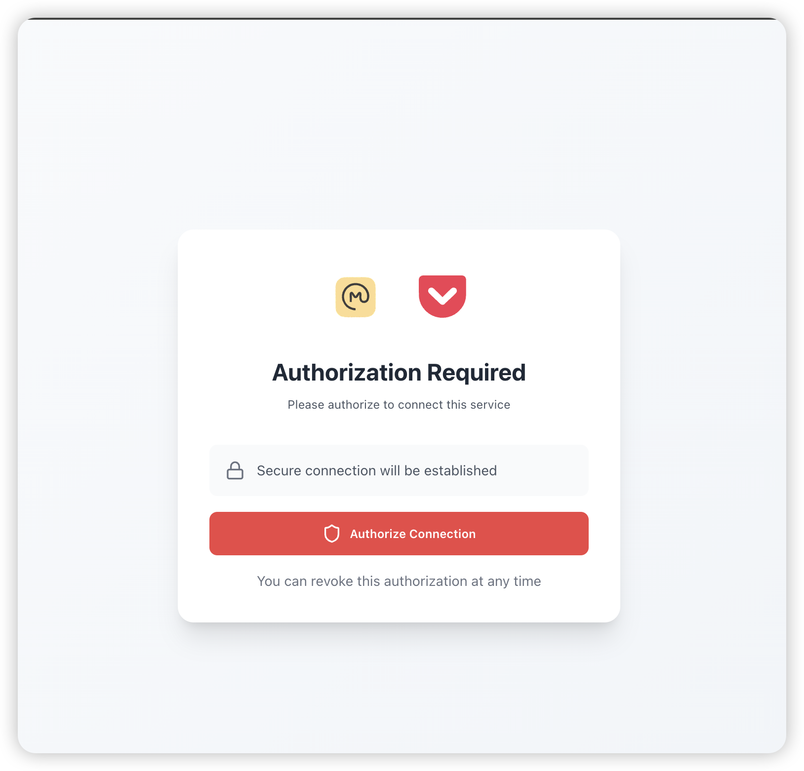
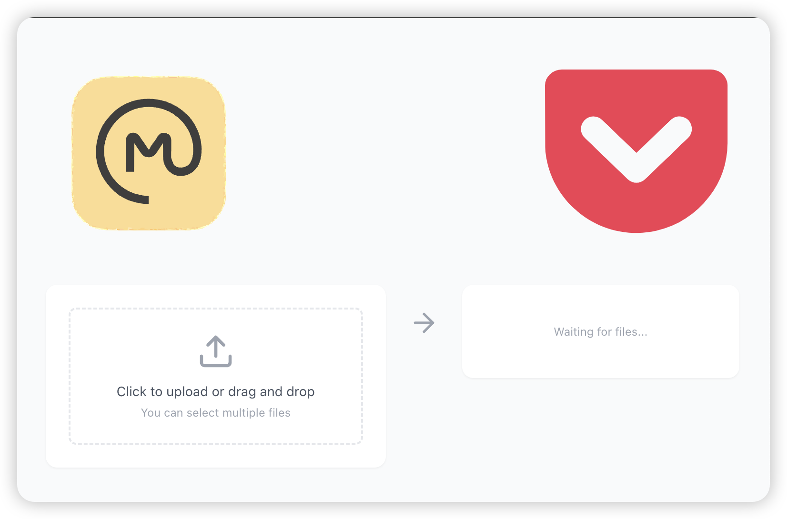

# Out-Omnivore

An extension helps user to migrate omnivore data to Pocket.

<p float='left'>


</p>

# How to run

## Download Release 

Download Release version

## Build

### Create Env file

create an .env file

```env
VITE_CONSUMER_KEY=  // # get consumer key https://getpocket.com/developer/
VITE_REDIRECT_URI= // # redirect url product home page
```

then

```shell
pnpm install
pnpm run build
```

## Run
load extension from dist dir
